## MiKit 简介

### 关于

MiKit 基于 [StartPoint](https://github.com/lildemon/contdelivery)，修复了一些已知 BUG，并结合当前业务添加了一些常用功能。

目前还是延用```nwjs```进行开发，等功能健全及时间空余将考虑使用功能、社区都更加完善的```Electron```进行重构。

### 功能

- 内置SSI(.shtml)的语法支持，实现html模块化，复用html代码
- SASS(.scss)语言支持，.scss文件为css的超集，可以在现有的css代码使用scss提供的语法&框架
- coffeescript语句编译
- 默认支持保存文件后自动刷新浏览器，无需额外配置
- 同时托管N个项目，不占用额外端口，项目之间以域名区分
- 整合了FIS的代码编译打包工具，实现自动压缩合并js、css文件，自动优化图片尺寸，css sprite、base64编码整合、自定义图片域名等功能
- 项目打包后的文件头部加上作者、团队、版本、编译时间等信息

### 系统

开发环境是```Win10-x64```，理论上支持 Win7 及以上的 64 位系统，32 位系统请谨慎下载。

### 下载

MiKit 目前选择发布到阿里巴巴的[TaoCode](http://code.taobao.org/p/MiKit/src/trunk/)，完整包以```MiKit_version.exe```命名，升级包以```MiKit_patch_oldversion_newversion.exe```命名，进入后找到对应版本下载即可。

## 快速入门

### 一、新建或打开项目

在文件夹上或文件夹内部右键```使用 MiKit 新建或打开``` 可以打开已有或新建项目。

**注意，这种方法会清空文件夹的内容，所以不要在桌面上或有重要文件的文件夹上右键打开**

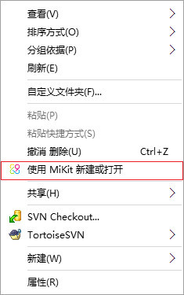

如果是没有```wwwroot```子文件夹，则会被认为是新项目，此时会有新建项目的界面，目前预留了三种方案，可以根据实现情况选择，这里演示用的是创建空项目，然后就可以在```wwwroot```存放平时用到的```HTML/CSS/JS/img```等文件。

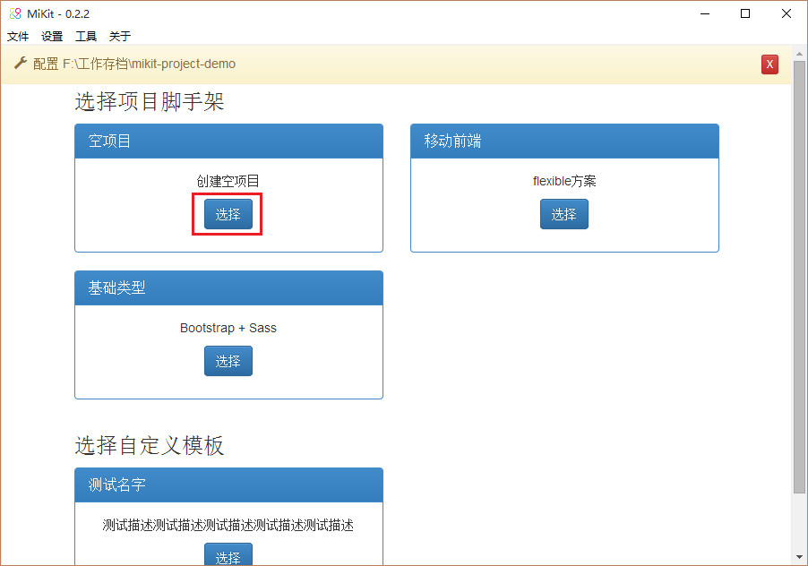

作者等信息默认读取全局设置信息，其它项目基本信息可以手动补全或不填写，最终这些信息会在项目根目录生成一个```package.json```文件。

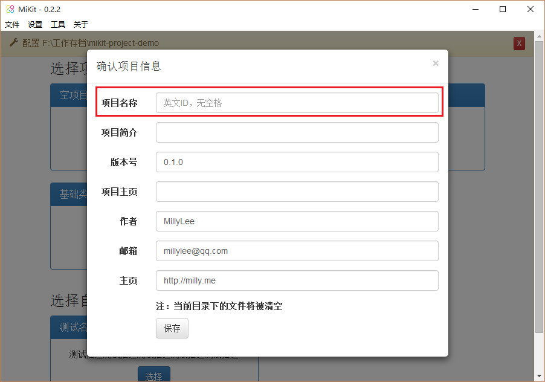

创建成功后会默认加载该项目，点击链接即可预览```wwwroot```里面的内容。

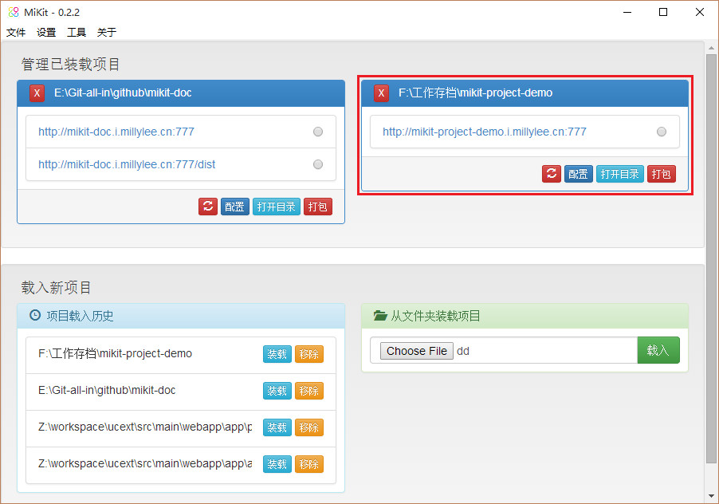

### 二、打开项目

打开一个已存在的项目除了上面介绍的方法，还可以直接从项目历史中载入（最多支持10条历史），```文件 -> 打开```，```从文件夹装载项目```三种方法。

使用```.shtml```与```sass```来模块化管理 HTML、CSS组件（组件都要添加```_```前缀，该类文件不会被编译），编码完点击打包即可合并编译文件为```.html```与```.scss```，以上就是最简单与常用的功能。

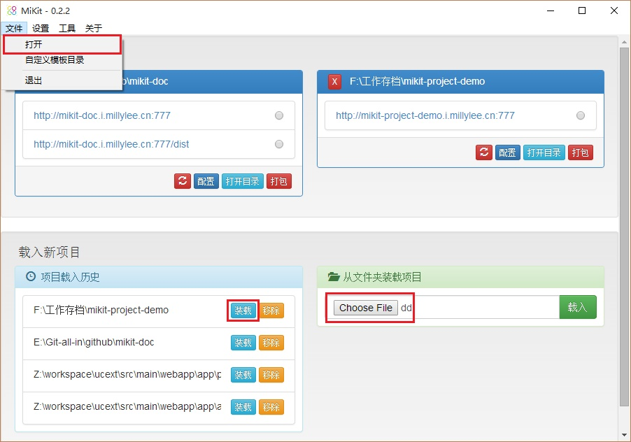

路径坚持使用英文命名是一个好习惯，认为看中文比较舒服可以在文件夹下新建一个```desktop.ini```来实现路径英文，但显示中文及自定义图标，文件内容如下。

```shell
[.ShellClassInfo]
LocalizedResourceName=本地站点
IconResource=D:\icons\icon_chrome.ico
[ViewState]
Mode=
Vid=
FolderType=Documents
```

通过以上定义显示的是自定义的图标和中文文件名

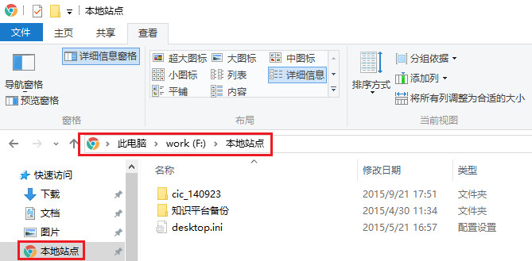

但查看路径时可以看出其实是英文路径

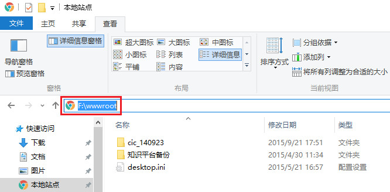

## 全局设置

### 一、作者信息

通过```设置 -> 作者信息```可以设置姓名、邮箱、主页等信息，供后期打包时自动在文件头部添加。

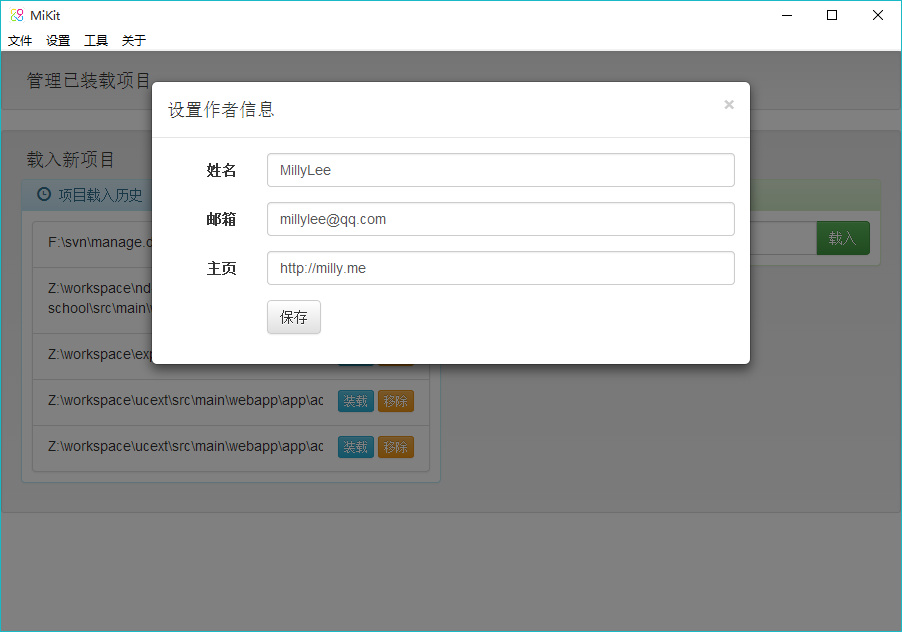

### 二、域名端口

通过```设置 -> 域名端口```可以设置域名信息，如果有个人域名，可以设置一个二级域名将 A 记录指向本机 IP，这样可以方便将域名丢给需求方查看效果，默认使用的是```local.milly.me```，但该域名指向的是```127.0.0.1```，所以不能直接丢给需求方，你可以将其转换成本机IP或找我配置一个域名。

由于开发中经常要开启其它带本地 Server 的软件，比如```Eclipse```，这时可以给 MiKit 设置一个其它端口，比如```777```，这样可以避免其它软件没有端口冲突提醒导致的服务启动失败。

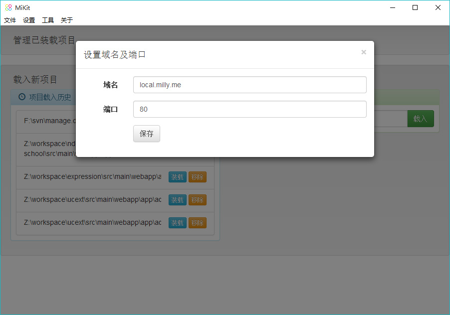

## 脚手架功能

### 一、脚手架

在文件夹上或文件夹内部右键```使用 MiKit 新建或打开```


这里可以看到默认的项目脚手架，这些脚手架是 MiKit 发布时选择的常用脚本架，你可以从其中选择一个用来初始化项目。

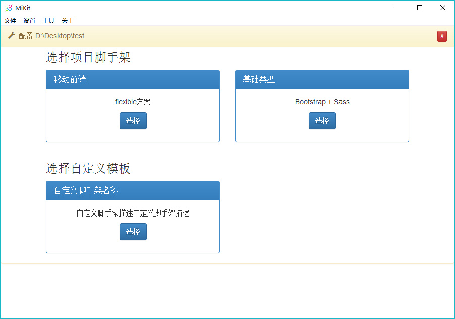

### 二、自定义脚手架

与脚手架类似，但该功能更加自由，允许自己添加一些常用脚手架或脚手架，理论上支持无限个。

通过```文件 -> 自定义脚手架目录```打开自定义脚手架的目录。

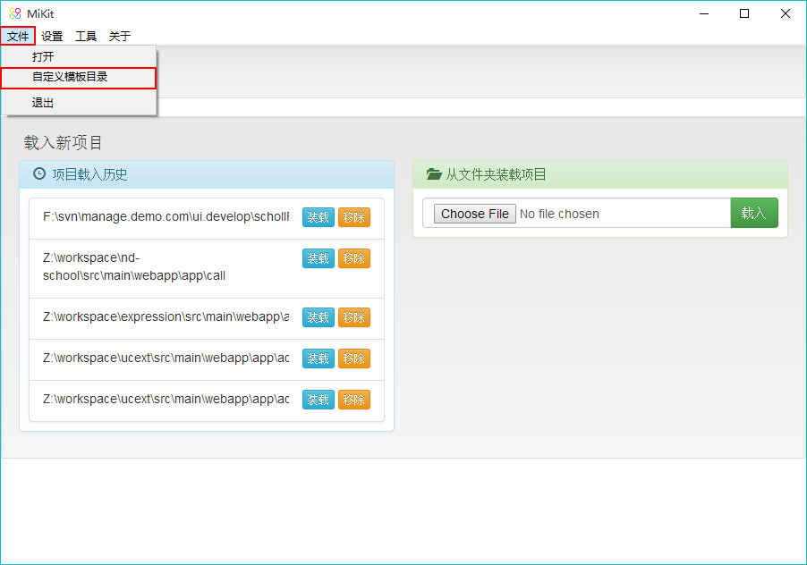

然后每个脚手架都有自己的文件夹，并在文件夹内包含```wwwroot```子文件夹，最终文件结构如下图所示，当新建一个脚手架后，记得在```mkpackage.json```里面添加脚手架相关信息。````scaffolding```为自定义脚手架信息数组。

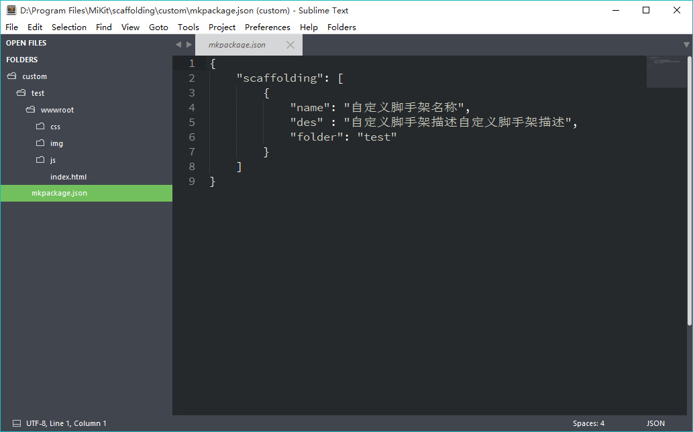

添加完自定义脚手架后最好重启下，接下来就可以和脚手架一样使用自定义脚手架的功能。


## 打包配置

### 一、输出目录名

由于使用场景中可能需要将打包后的文件发给需求方，所以MiKit增加了输出目录名的配置。

加载项目后点击```配置```进入到配置页，在```打包配置```这里可以看到```输出目录名```，这里可以设置需求的文件夹名称，支持中文，点击保存按钮确定。

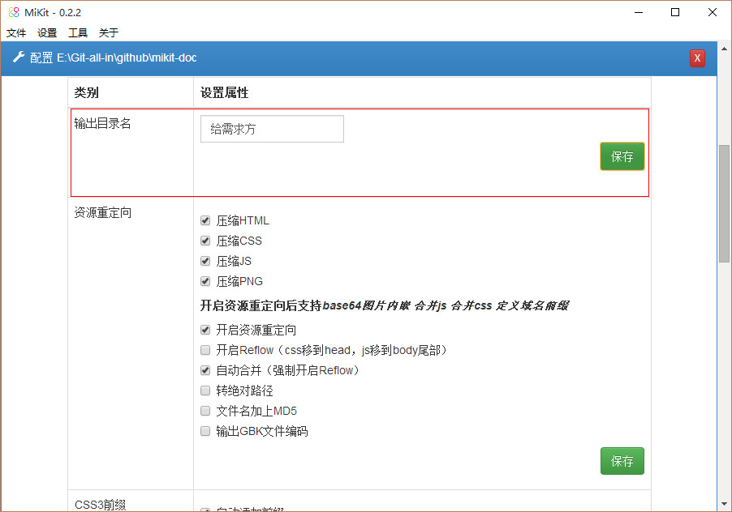

返回到主界面点击打包按钮即可使用新的输出目录名，打包完成后会自动打开文件项目文件夹，此时直接将打包后的文件夹发给需求方即可。

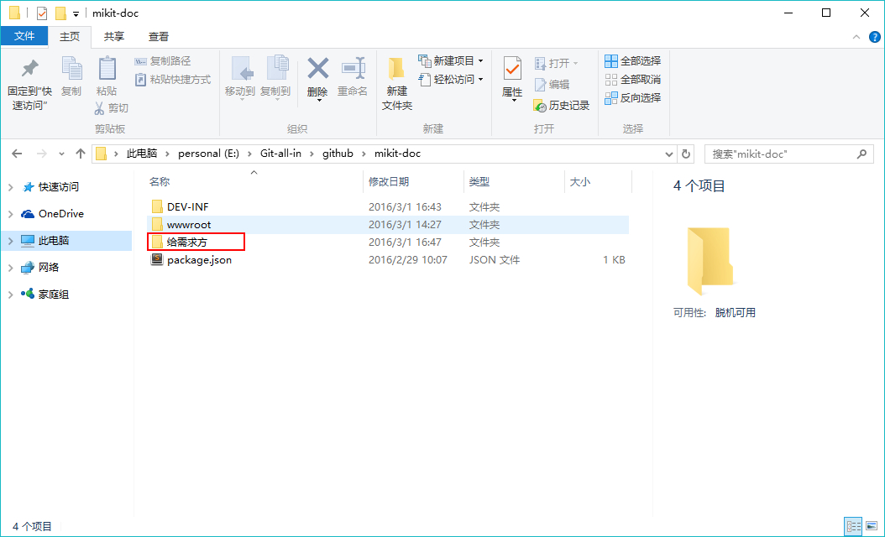

有一点需求注意，**新版本为了防止旧文件的冗余，打包前会先删除输出文件夹，所以不要将一些重要文件放在```dist```或你设置的输出文件夹，或者将输出目录名设置成```wwwroot```等**。

### 二、资源重定向

- 压缩 HTML：压缩 .html 文件
- 压缩 CSS：压缩 .css 文件
- 压缩 JS：压缩 .js 文件
- 压缩 PNG：压缩 .png 文件
- 开启资源重定向：可自动生成雪碧图，需要在生成雪碧图的图片地址后面加上```?__sprite```，最终生成的图片与CSS在同一个目录
- 开启Reflow：CSS 移动到 head 部分，JS 移动到 body 尾部
- 自动合并（强制开启Reflow）：自动合并CSS与JS文件，并且会强制执行 Reflow
- 转绝对路径：一般不需要开启，可直接使用图片资源域名与全局资源域名
- 文件名加上MD5：打包后将在文件名后面自动加上MD5
- 输出GBK文件编码：如果是 HTML 文件需要先将```<meta charset="UTF-8">```改成 GBK，然后再进行转换才能保证中文不会乱码。


### 三、CSS3前缀

默认情况只需勾选```自动添加前缀```即可，打包时就会根据所有主流浏览器的最近2个版本支持情况来添加前缀，该数据来自CanIuse；当前，也可以自己设置更多规则，比如移动端基本不考虑```WindowPhone```，所以不用``-ms-````前缀。

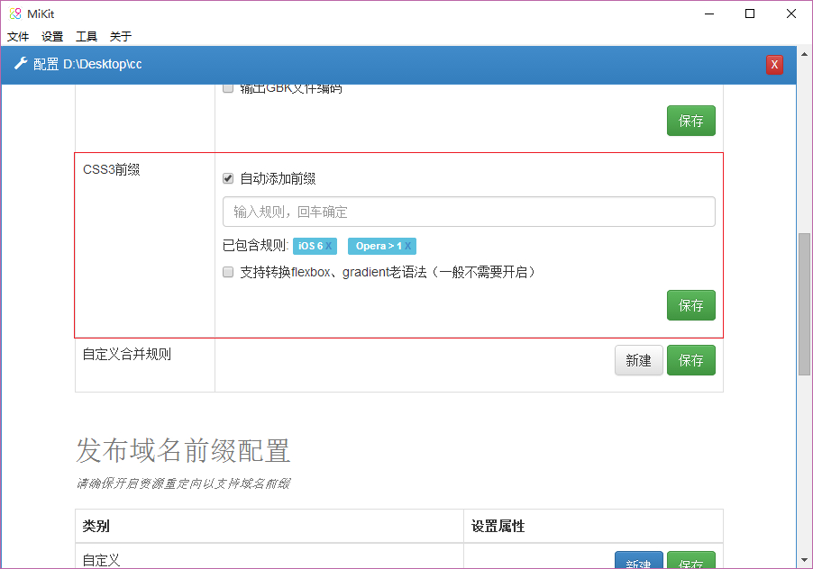

所有的浏览器规则可以在[Browserslist](https://github.com/ai/browserslist#queries)中查看，以下做一个简要的介绍。

#### 规则说明：

- ```last 2 versions```: 所有主流浏览器最近2个版本
- ```last 2 Chrome versions```: Chrome 最近2个版本
- ```> 5%```: 全球范围内大于5%的使用
- ```> 5% in US```: 美国地区大于5%的使用
- ```ie 6-8```: ie 6/7/8
- ```Firefox > 20```: 火狐版本大于20
- ```Firefox >= 20```: 火狐版本大于等于20
- ```Firefox < 20```: 火狐版本小于20
- ```Firefox <= 20```: 火狐版本小于等于20
- ```iOS 7```: iOS 7 浏览器
- ```not ie <= 8```: 不考虑 ie8 及 ie8 以下

#### 主流浏览器代号：

- ```Chrome``` 表示 Google Chrome
- ```Firefox``` 或 ```ff``` 表示 Mozilla Firefox
- ```Explorer``` 或 ```ie``` 表示 Internet Explorer
- ```Edge``` 表示 Microsoft Edge
- ```iOS``` 或 ```ios_saf``` 表示 iOS Safari
- ```Opera``` 表示 Opera
- ```Safari``` 表示桌面版的 Safari
- ```ExplorerMobile``` 或 ```ie_mob``` 表示移动版Internet Explorer

#### 其它浏览器代号：

- ```Android``` 表示安卓 Webview
- ```BlackBerry``` 或 ```bb``` 表示黑莓浏览器
- ```ChromeAndroid``` 或 ```and_chr``` 表示安卓版的Chrome (基本表现和Chrome差不多)
- ```FirefoxAndroid``` 或 ```and_ff``` 表示 安卓版Firefox
- ```OperaMobile``` 或 ```op_mob``` 表示 Opera Mobile
- ```OperaMini``` 或 ```op_mini``` 表示 Opera Mini

一般不用开启``支持转换flexbox/gradient老语法````功能，除非原来的样式表中使用到了旧的语法，开启该功能后会帮你添加新语法，例如：

flexbox老语法：

```
.foo {
    display: -webkit-box;
    -webkit-box-pack: justify;
}
```

转换后：

```
.foo {
    display: -webkit-box;
    display: flex;
    -webkit-box-pack: justify;
    justify-content: space-between;
}
```

gradient老语法：

```
.foo {
    background: -webkit-gradient(linear, left top, left bottom, color-stop(0, #ffffff), to(#f0efe7));
}
```

转换后：

```
.foo {
    background: -webkit-gradient(linear, left top, left bottom, color-stop(0, #ffffff), to(#f0efe7));
    background: linear-gradient(to bottom, #ffffff 0%, #f0efe7 100%);
}
```

### 四、自定义合并规则

> 暂不可用

## 发布域名前缀配置

### 一、自定义

> 高级功能且目前支持不完善，直接使用图片资源域名或全局资源域名即可满足大部分场景。

**注意：以下功能都需要开启资源重定向功能**

### 二、图片资源域名

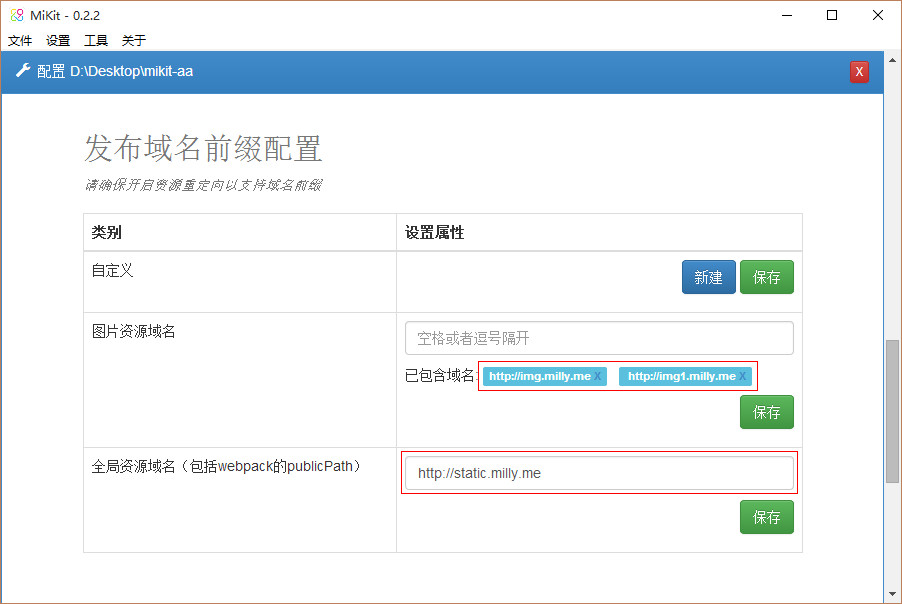

如图所示添加域名，不要以```/```结尾，可添加多个 CDN 地址，MiKit 会自动查找本地图片是否存在，如果存在则随机添加 CDN 地址。

### 三、全局资源域名

与图片资源域名类似，全局资源域名是指给 ```html``` 里面引用到的本地 CSS/JS 等地址添加域名前缀。

**打包前**

```html
<!DOCTYPE html>
<html lang="zh-cmn-Hans">
<head>
<meta charset="UTF-8">
<meta name="viewport" content="width=device-width, initial-scale=1.0">
<title>Public Domain</title>
<link type="text/css" rel="stylesheet" href="css/pure-min.css">
<link type="text/css" rel="stylesheet" href="css/custom.css">
</head>
<body>
<script type="text/javascript" src="js/lib/markd.js"></script>
<script type="text/javascript" src="js/lib/highlight.min.js"></script>
<script type="text/javascript" src="js/main.js"></script>
</body>
</html>
```

**打包后**

```html
<!DOCTYPE html>
<html lang="zh-cmn-Hans">
<head>
<meta charset="UTF-8">
<meta name="viewport" content="width=device-width, initial-scale=1.0">
<title>Public Domain</title>
<link type="text/css" rel="stylesheet" href="http://static.milly.me/css/pure-min.css">
<link type="text/css" rel="stylesheet" href="http://static.milly.me/css/custom.css">
</head>
<body>
<script type="text/javascript" charset="utf-8" src="http://static.milly.me/js/lib/markd.js"></script>
<script type="text/javascript" charset="utf-8" src="http://static.milly.me/js/lib/highlight.min.js"></script>
<script type="text/javascript" charset="utf-8" src="http://static.milly.me/js/main.js"></script>
</body>
</html>
```

## 虚拟目录配置

### 一、虚拟目录用法

正常情况下访问的是```wwwroot```目录，如果我们打包后的文件夹是与```wwwroot```同级的```dist```目录，此时想通过域名的方式是无法访问到的。此时，就需要用到虚拟目录功能。

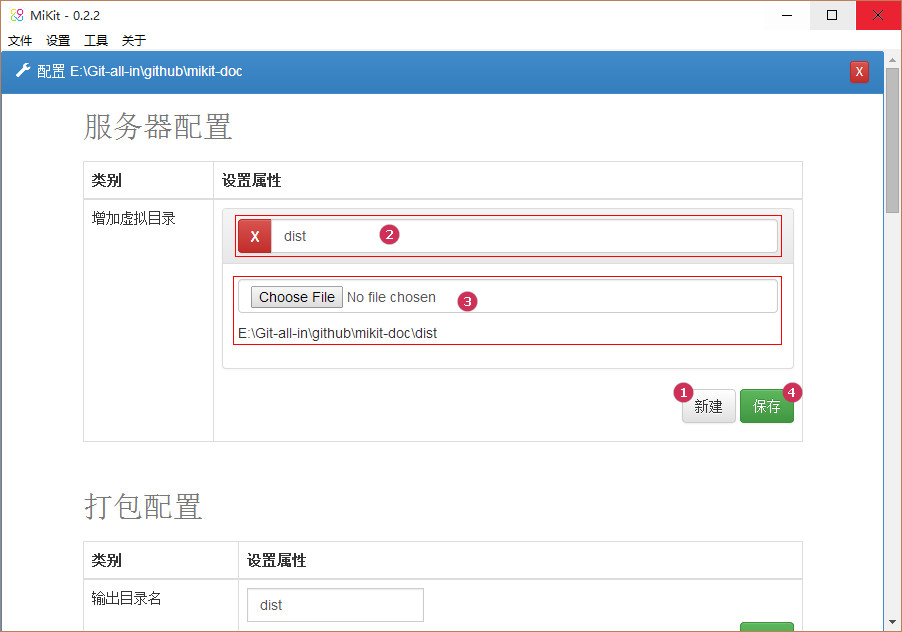

1. 选择新建来增加虚拟目录
2. 输入虚拟目录名，例如：```dist```
3. 选择待访问的目录，例如该项目打包后的```dist```目录
4. 保存即可

回到主界面，可以看到包含了虚拟目录的链接，点击该链接就可以访问对应的目录。

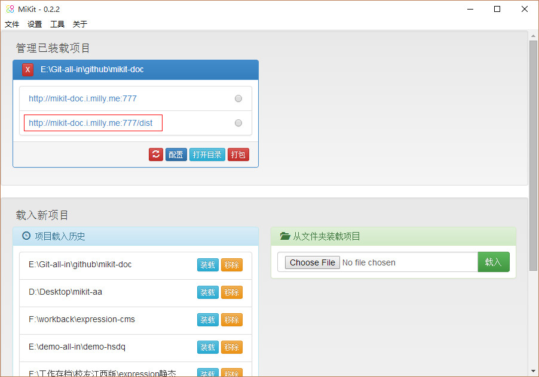

如下图所示，如果选中虚拟目录，则可以用主域名来直接访问虚拟目录。此时访问主域名时就是直接指向```dist```而非```wwwroot```目录。

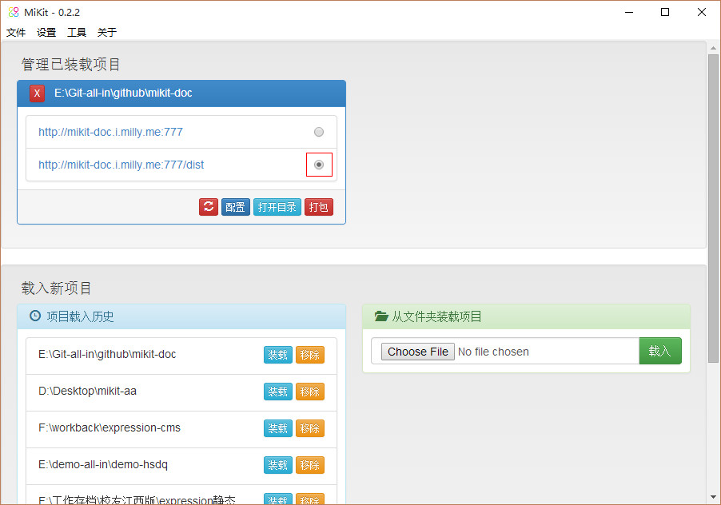

### 二、虚拟目录小技巧

虚拟目录并非只能用在当前项目，我们可以设置一个```desktop```来指向桌面或其它目录来当一个本地静态文件服务器。

## Webpack 配置

### 一、Pack目录名

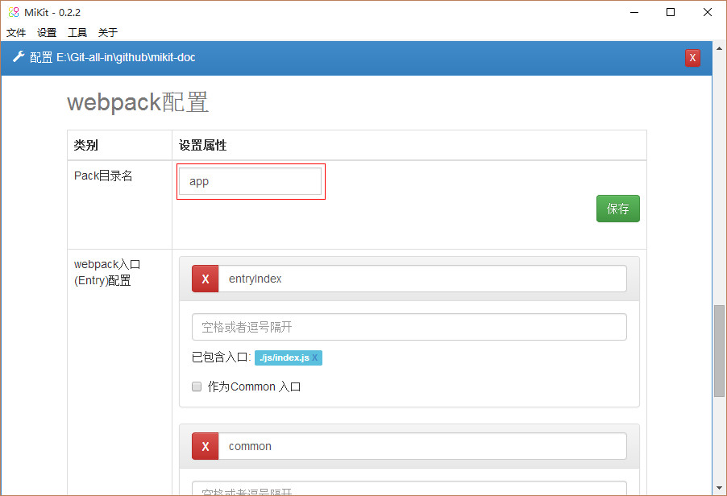

```pack```是 Webpack 打包 CommonJS 等风格文件为浏览器可解析文件的目录。开发阶段该目录的文件是实时更新的，文件需要打包后才能看得到，但我们可以在 ```.html``` 中引入，例如：

```javascript
// 打包前该文件在目录中是看不到的
<script src="app/main.js"></script>
```

**小技巧:** 如果文件放在 Eclipse 项目中，那么可以把 MiKit 当成 SCSS 与 CommonJS 编译器，直接引用对应文件的网址，比如本项目使用到的是```http://mikit-doc.i.milly.me```，那么该项目下面的SCSS、以及Pack下面的文件可以直接引入其它页面中，并且是实时刷新的。

```javascript
//样式引用
<link href="http://mikit-doc.i.milly.me/css/style.css">
//脚本引用
<script src="http://mikit-doc.i.milly.me/app/main.js"></script>
```

### 二、Entry 配置

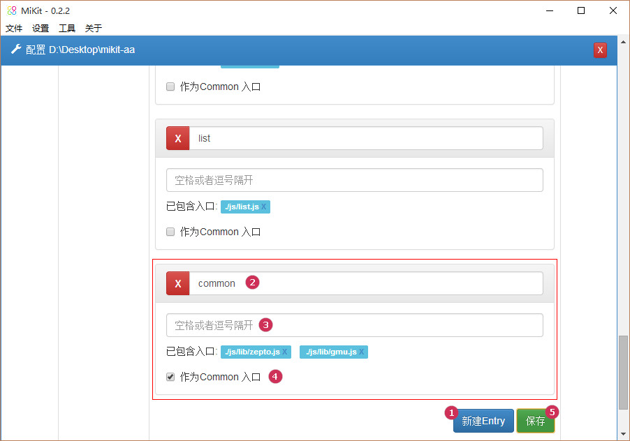

Webpack 入口文件配置，这里设置哪些文件要被打包成入口文件或公共文件。设置为公共文件后 Webpack 会自动帮我们提取出共同部分，这样在页面中引入这个共同文件即可，其它不一致的部分再单独引用。例如上图的配置，我们只需要在页面这样引入：

```javascript
//首页可能是这样
<script src="app/common.js"></script>
<script src="app/index.js"></script>

//列表页
<script src="app/common.js"></script>
<script src="app/list.js"></script>
```

### 三、实验性

> 暂不可用

### 四、Alias 配置

> 暂不可用

### 五、其它说明

1、MiKit 预留了一个功能，```PRODUCTION``` 在打包前为 ```false```，打包后为```true```，可以由此来切换生产环境或开发环境，选择是否输出调试信息等。

```javascript
if (PRODUCTION) {
    console.log('生产环境');
} else {
    console.log('开发环境');
}
```

2、如果第三方库或文件不支持 CommonJS，则可以使用以下方式来调用。

```javascript
var foo = require("exports?foo!./normal");
foo();
```

3、MiKit 同样支持在项目根目录下新建```webpack.config.js```的方式来实现相同功能，修改后需要重启 MiKit 打包才能生效。当然，写法与原生的```webpack.config.js```略有不同。除非对 webpack 比较熟悉，不然不推荐这种方式修改。

```javascript
module.exports = function(webpack) {
    return {
        //这里webpack配置写法
        entry: {
        entryIndex: './js/index',
entrySub: './js/sub'
},
resolve: {
alias: {
'jquery': 'jquery-1.7.2'
},
extensions: ['', '.js', '.coffee', '.html', '.css', '.scss']
}
//more...
};
};
```

4、使用 Webpack 配置时一些错误并不会在浏览器端呈现，这里可以通过```工具-开发者工具```来调试，这里会展示项目中 Webpack 的运行情况。

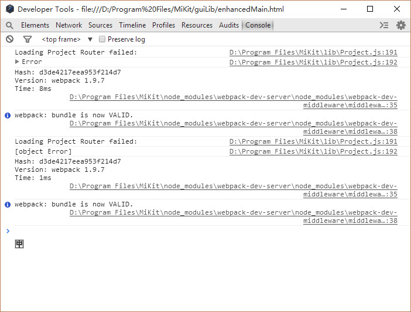