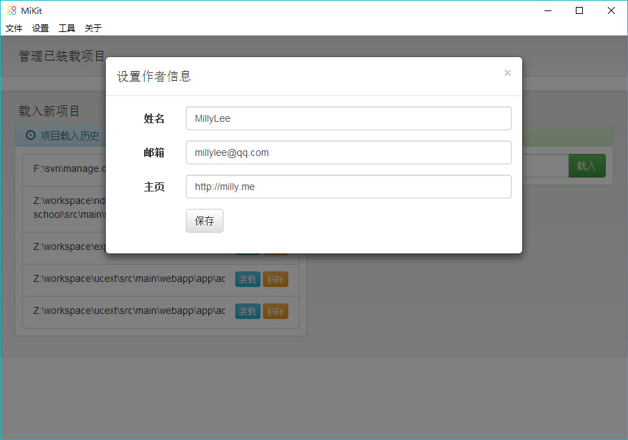

# 全局设置

## 一、作者信息

通过```设置 -> 作者信息```可以设置姓名、邮箱、主页等信息，供后期打包时自动在文件头部添加。



## 二、域名端口

通过```设置 -> 域名端口```可以设置域名信息，如果有个人域名，可以设置一个二级域名将 A 记录指向本机 IP，这样可以方便将域名丢给需求方查看效果，默认使用的是```local.milly.me```，但该域名指向的是```127.0.0.1```，所以不能直接丢给需求方，你可以将其转换成本机IP或找我配置一个域名。

由于开发中经常要开启其它带本地 Server 的软件，比如```Eclipse```，这时可以给 MiKit 设置一个其它端口，比如```777```，这样可以避免其它软件没有端口冲突提醒导致的服务启动失败。

